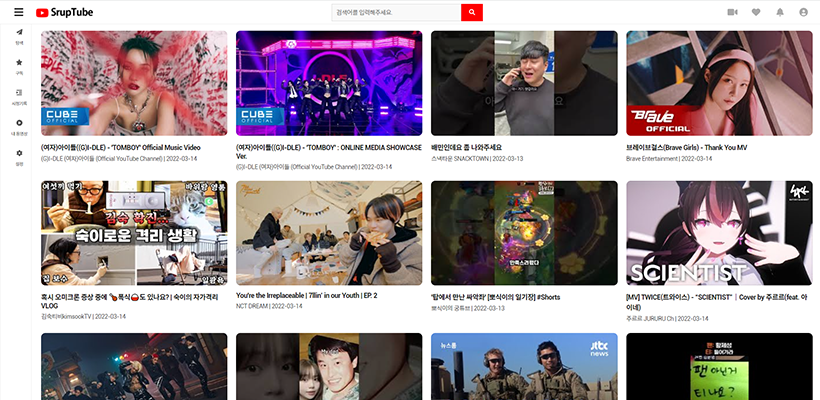
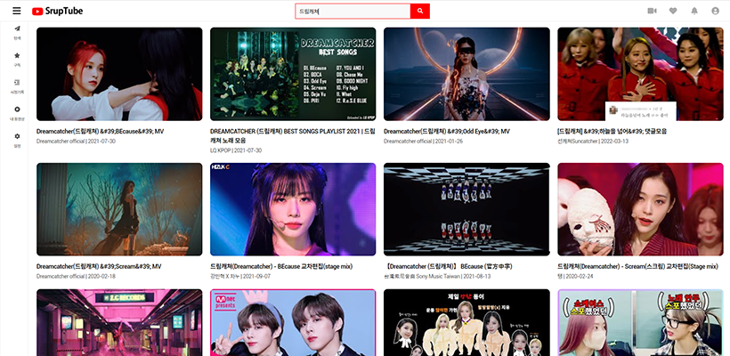
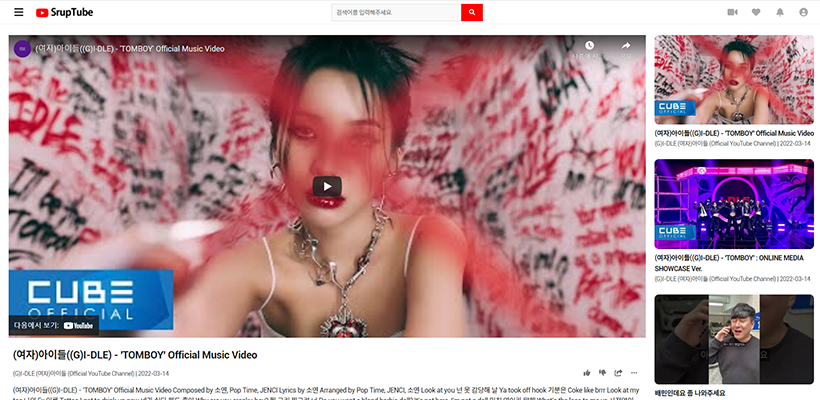

<b>[개인 프로젝트] 2022.3.01 ~ 2022.3.15


  <h1> 유튜브 API을 활용한 프로젝트 - SrupTube </br> https://sruptube.herokuapp.com/</h1>
  
  </br>
  
## 주요 기능 
  1. 네이버 Api를 이용한 인기 영상 리스트 20개 + 서치 영상리스트 20개 출력
  2. 영상페이지 이동 후 영상시청 가능
  
</br>
  
## 활용 기술
  1. html
  2. css
  3. React.js
  4. node.js
  5. express
  6. heroku


</br>

## 개요 
- 개인 프로젝트로 유튜브 API를 이용해 API사용의 이해와 프론트엔드에 한걸음 더 가까워 지는 프로젝트를 진행하였다.
- 이전 배웠던 리액트 프로젝트 토대로 홀로 API를 이용하여 배포까지 진행하는 프로젝트를 진행하였다.
 

</br>

## 1. 문제이슈 [node / Express] 템플릿과 html 관한 오류 

> 
> [에러코드] 
> Error: No default engine was specified and no extension was provided
> 


node.js express로 html file을 로드할때 에러가 발생하는 현상이었다. 
이에대하여 스택오버플로우와 검색을 통해 쉽게 해결할 수 있는 방법은 2가지 정도라고 생각되었다.
이미 view파일에 ejs를 이용하여 템플릿을 만들어두었던 상태이기때문에 탬플릿으로 화면엔진을 설정해주었다

</br>

> 
> [해결방법] 
> 1.EJS(탬플릿)으로 엔진 설정하기   2.sendFile로 html파일을 뿌리기
> 


</br>

[node / Express] 템플릿과 html 관한 오류해결에 도움을 주었던 사이트 
1. https://codingsquirrel.tistory.com/33
2. https://stackoverflow.com/questions/25270434/nodejs-how-to-render-static-html-with-express-4

</br> 

1. 설치
 ```javascript
    npm install html
 ```
 
 </br> 
 
 2. APP/index.js
 ```javascript
    const __dirname = path.resolve();
    
    // build파일 불러오기 //__dirname => 현재 경로
    app.use(express.static(path.join(__dirname, "./client/build"))); 
    app.use(express.json());
    app.use(express.urlencoded({ extended: true }));
    
    //sendFile로 html파일을 뿌리기
    app.get("*", (req, res) => {
     res.sendFile(path.join(__dirname, "./client/build/index.html"));
    });
 ```

</br>


## 2. 문제이슈 [Mixed content 문제 해결]

> 
> [에러코드] </br>
> Error: Mixed Content: The page at 'https://plprice.netlify.app/' was loaded over HTTPS, but requested an insecure script </br>
>'http://api.vworld.kr/req/searchservice=search&version=2.0&request=search&format=json&type=ADDRESS&category=PARCEL&query=%EB%B4%8>  
> 9%EB%82%A8%EB%A6%AC%20720-9&callback=jQuery351016469620631517623_1610625986322&_=1610625986323'. 
> This request has been blocked; the content must be served over HTTPS.
> 


https 사이트에서 ajax를 사용해서 비동기로 http 사이트에 request를 요청해서 문제가 발생 했습니다. 암호화된 HTTPS 기반의 사이트에서 암호화되지 않은 HTTP 사이트에 요청을 보내서 Mixed content 에러가 발생한 것입니다.

</br>


Mixed content 문제 오류해결에 도움을 주었던 사이트 
1. https://wellsw.tistory.com/34


</br> 

1. ./APP/client/public/index.html - html파일 head에 추가
 ```javascript
    <meta http-equiv="Content-Security-Policy" content="upgrade-insecure-requests" />
 ```
 
</br>

--------------------------------------------

</br>
 
 ## 완성된 페이지
 
#### 1. 메인 (인기 동영상 List)

 
#### 2. 영상 검색

  
#### 3. 영상 상세페이지

   


